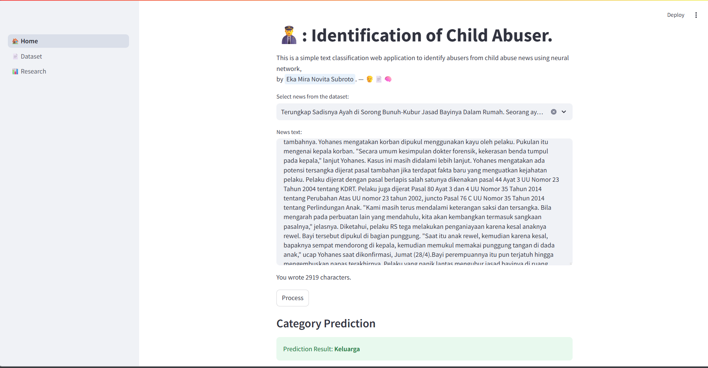
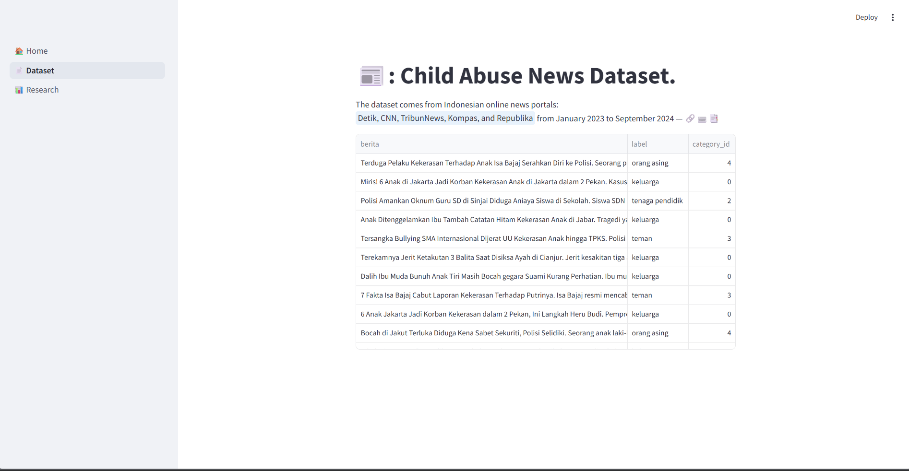
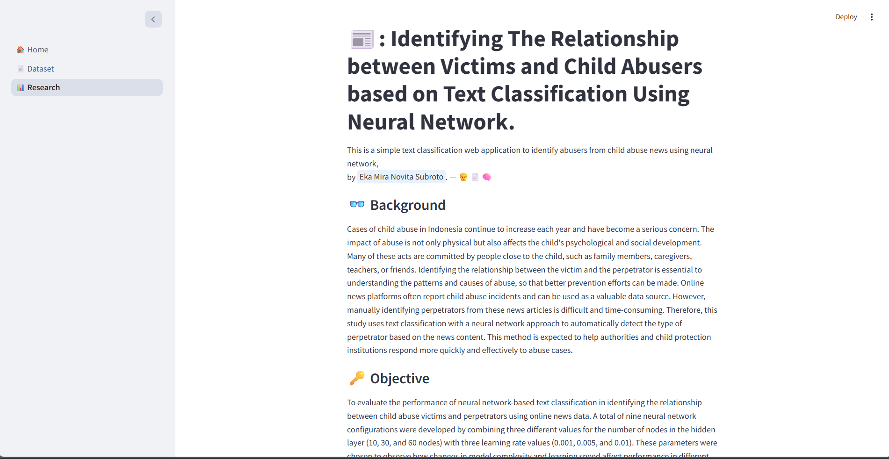

# Classification of Child Abuser

This repository contains the final project (undergraduate thesis) of Eka Mira Novita Subroto, focusing on identifying and classifying the relationship between victims and perpetrators in child abuse cases based on online news articles. This system uses **text classification with Neural Network (NN)** and is built with **Streamlit** for the web-based interface.

## 🚀 Features

- ✅ Data preprocessing (case folding, tokenization, stopword removal, etc.)
- ✅ Feature extraction using Word2Vec
- ✅ Classification using Neural Network (Sequential model)
- ✅ Interface built with Streamlit
- ✅ Three main navigation pages:
  - **Home**: Input article/news and get classification result
  - **Dataset**: Explore dataset and model performance
  - **Research**: Introduction and project overview

## 📊 Dataset

- Collected from Indonesian news portals (Detik, TribunNews, CNN, etc.)
- Total articles: 1,013
- Manually labeled based on the abuser's relationship to the victim
- Categories:
  - Family
  - Neighbors
  - Friends
  - Caregivers
  - Teachers
  - Strangers

## 🧠 Model

- Neural Network from scratch
- Input: Word2Vec (scratch) vectors
- Output: Classification label of abuser category
- Evaluation metrics: Accuracy, Precision, Recall, F1-score

## 🖥️ Streamlit UI

Screenshot of the application:

> ℹ️ Screenshots are available in the `/UI` folder
